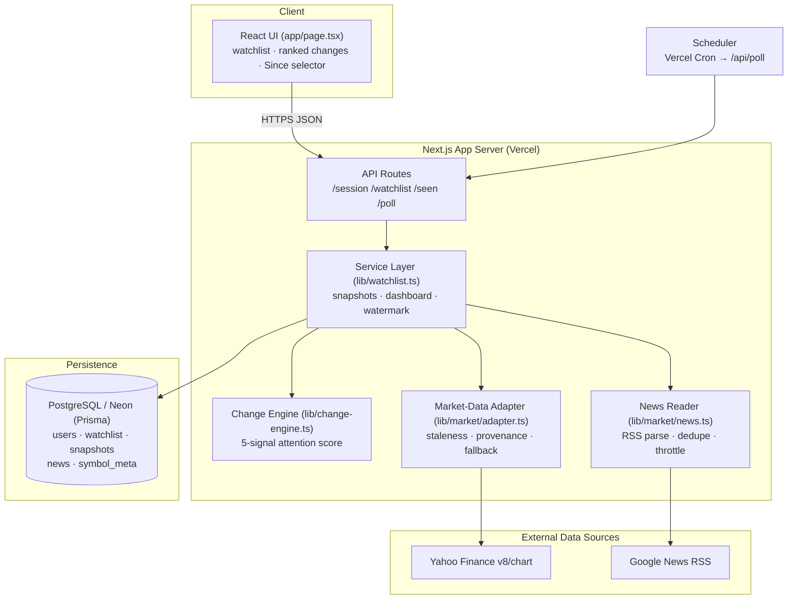
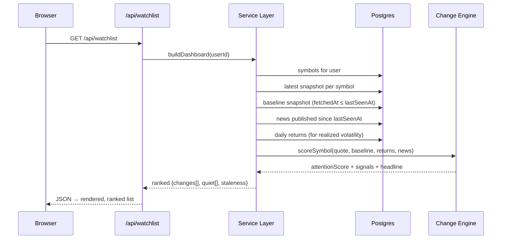
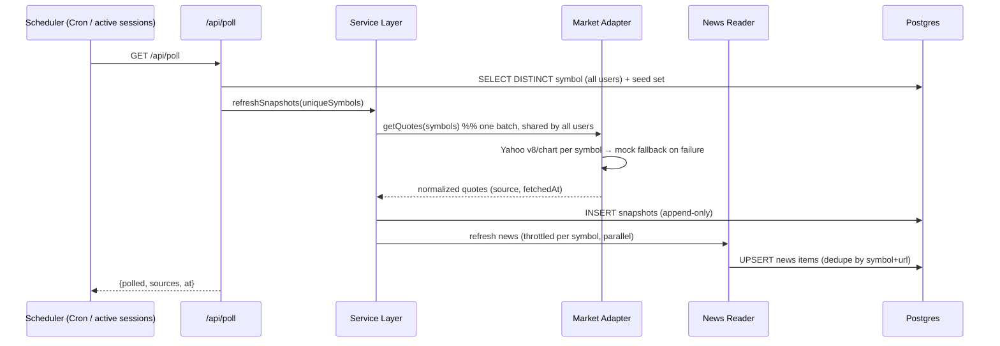
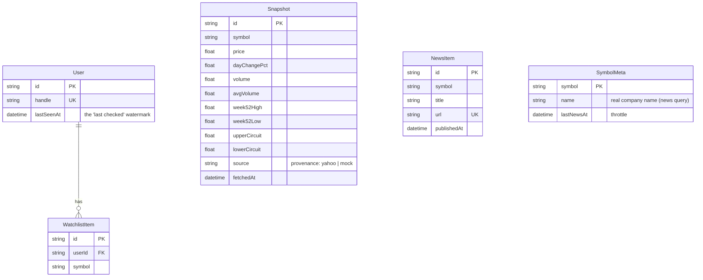

# Smart Market Watchlist — Design Document

| | |
|---|---|
| **Status** | Final (v1.0) |
| **Category** | Engineering Build Challenge — CODE 2026 |
| **Theme** | Build a Smart Market Watchlist |
| **Last updated** | 2026-09-06 |
| **Live system** | https://groww-smart-watchlist-rukmini1.vercel.app |

---

## 1. Abstract

The Smart Market Watchlist reframes a watchlist from a *passive live-price list*
into an **attention engine**. Instead of asking the user to scan rows and set
manual alerts, the system answers a sharper question on every visit: **"what has
meaningfully changed since I last looked, and what deserves my attention first?"**

The central design bet is that **"meaningful" is relative, not absolute**. A 2%
move is a large event for a stable large-cap and statistical noise for a volatile
small-cap. We therefore score every change against *the stock's own normal
behaviour* across five independent signals, combine them into a single attention
score, and present a ranked list with a plain-English reason per item — with zero
alert configuration by the user.

---

## 2. Problem Statement & Context

Users track stocks to notice change, but existing watchlists surface *state*
(current price) rather than *change since last seen*. The burden of detecting
what matters is pushed onto the user through manual, threshold-based alerts. This
fails two ways: fixed thresholds mis-fire (too noisy for volatile names, too
quiet for stable ones), and the user must know in advance what to watch for.

**Goal:** a watchlist that computes what changed since the user's last visit,
decides what is meaningful *per stock*, and ranks it — reliably, with real data,
and in a way that persists across sessions and devices.

---

## 3. Tenets

1. **Judgement over configuration.** The system decides what is meaningful; the
   user configures nothing.
2. **Relative, not absolute.** Significance is measured against each stock's own
   volatility and history.
3. **Never fabricate.** Real data or an honestly-labelled fallback — never a
   silent guess.
4. **Correct under concurrency.** Append-only state; no torn reads, no lost
   writes.
5. **Simple until complexity earns its place.** Every component must be
   justifiable against the problem; scope creep is rejected explicitly.

---

## 4. Requirements

### 4.1 Functional

| # | Requirement |
|---|---|
| F1 | Create and manage a per-user watchlist (add/remove NSE symbols) |
| F2 | Show latest market information per symbol (price, day change, volume) |
| F3 | On return, compute and rank **what changed since last checked** |
| F4 | Persist state across sessions and devices |
| F5 | Surface *why* each item matters in plain English |

### 4.2 Non-functional

| # | Attribute | Target |
|---|---|---|
| N1 | **Reliability** | Degrade gracefully when a data source fails; never crash a request |
| N2 | **Data integrity** | Never present stale data as live; deterministic conflict resolution |
| N3 | **Consistency** | Cross-device reads reflect the same server-side state |
| N4 | **Scalability** | Data-fetch cost independent of user count |
| N5 | **Latency** | Dashboard read served from cached snapshots (no synchronous upstream fan-out) |
| N6 | **Maintainability** | Pure, testable core; provider-abstracted data layer |

### 4.3 Out of scope (conscious cuts)

Real authentication/credentials, order placement/trading, charting, push
notifications, and **portfolio/broker holdings sync**. The last is deliberate:
this is a *watchlist* (stocks you track), not a *portfolio tracker* (stocks you
own). Holdings sync and position-weighting are a different product and would be
scope creep against the core question.

---

## 5. High-Level Architecture



**Component responsibilities**

| Component | Responsibility |
|---|---|
| **UI** | Render the ranked watchlist; select lookback window; mark-as-seen |
| **API Routes** | Thin HTTP boundary; auth via handle cookie; force-dynamic |
| **Service Layer** | Orchestrates reads/writes; builds the dashboard; owns the watermark |
| **Change Engine** | Pure function: scores change signals into an attention score |
| **Market-Data Adapter** | Normalises quotes; tags provenance & staleness; mock fallback |
| **News Reader** | Fetches/parses Google News RSS; dedupes; throttles per symbol |
| **Persistence** | Append-only snapshots + relational state (Prisma/Postgres) |
| **Scheduler** | Triggers `/api/poll` to refresh shared, per-symbol data |

---

## 6. Key Workflows

### 6.1 Read path — "what changed since I last checked"



The anchor is always the user's `lastSeenAt` watermark — if nothing changed
since then, the "needs attention" list is simply empty. Staleness is computed at
read time as a function of "now"; rows are never mutated to mark them stale.

### 6.2 Write path — scheduled ingestion (fan-out control)



**Key property:** the poller fetches each **unique** symbol **once**, shared
across every user. Fetch cost is decoupled from the number of users.

---

## 7. Data Model



**Design notes**

- **Snapshots are append-only.** A price row is never mutated. This is what makes
  "diff since a point in time" both possible and correct, and it removes an
  entire class of read/write races by construction. `Snapshot` is intentionally
  *not* a foreign-key child of a user — it is shared, per-symbol market state.
- **One watermark per user** (`lastSeenAt`) models the single, human-sized
  concept "since I last checked". It advances only on an explicit "mark as seen";
  if nothing changed since it, the attention list is empty — the honest result.
- `SymbolMeta` caches the resolved company name and throttles news fetches
  (news changes far more slowly than price).

---

## 8. The "Meaningful Change" Model (core algorithm)

Each symbol is scored across five independent signals (`lib/change-engine.ts`).
Signal scores are in `[0,1]`; discrete, hard events carry more weight than
continuous drift.

| Signal | Definition | Weight |
|---|---|---|
| **News** | a real headline published since the anchor | 1.0 |
| **Circuit** | price locked in upper/lower circuit | 1.0 |
| **Breakout** | crossed / near 52-week high or low | 0.9 |
| **Price (volatility-relative)** | `|move since anchor| ÷ typical daily move` (z-score) | 0.8 |
| **Volume** | today's volume ÷ 3-month average | 0.6 |

**Typical daily move** = the stock's realized volatility from ≥3 days of history;
otherwise a market-cap-based prior (large-cap ≈ 1.2%, mid ≈ 1.8%, small ≈ 2.8%) —
a principled prior, since size strongly predicts volatility.

**Combination — weighted noisy-OR.** Each signal is independent evidence that
"something happened", so multiple moderate signals compound while the total stays
bounded in `[0,1]`:

```
attentionScore = 1 − Π_i (1 − wᵢ · sᵢ)
```

Symbols with `attentionScore ≥ 0.25` appear under **"Needs your attention"**,
ranked descending; the rest are **"quiet"**. The highest-weighted firing signal
becomes the card's plain-English headline (e.g. *"↑ 4.7% since you last checked —
1.7× its typical daily move"*).

> **Why this beats a fixed % threshold:** a fixed threshold mis-scores both ends
> of the volatility spectrum. Normalising by the stock's own behaviour makes the
> same 4% move rank differently for a bond-like large-cap vs. a volatile
> small-cap — which is exactly what a human trader intuits.

---

## 9. API Design

| Method | Route | Purpose |
|---|---|---|
| `POST` | `/api/session` | Sign in / create user by handle (sets cookie) |
| `GET` | `/api/session` | Current handle |
| `GET` | `/api/watchlist?since=<hours>` | Ranked dashboard for a lookback window |
| `POST` | `/api/watchlist` | Add a symbol |
| `DELETE` | `/api/watchlist` | Remove a symbol |
| `POST` | `/api/seen` | Advance the "last checked" watermark (atomic) |
| `GET` | `/api/poll` | Scheduled ingestion (cron-triggered) |

All data routes are `force-dynamic` and identity-scoped via the handle cookie.

---

## 10. Design Decisions & Alternatives

| Decision | Chosen | Alternative rejected | Rationale |
|---|---|---|---|
| Stack | Next.js full-stack | Separate SPA + API service | One repo/deploy, instant live URL, still cleanly layered |
| Persistence | Postgres (server-side) | Browser `localStorage` | Cross-device is a hard requirement; client storage fails it |
| Price history | Append-only snapshots | Mutate-in-place latest row | Correct deltas + race-free by construction |
| Significance | Volatility-relative multi-signal | Fixed % threshold | Fixed % mis-scores stable and volatile names alike |
| "Last checked" | One watermark per user | Per-symbol watermarks / lookback selector | Faithful to "since I last checked"; no per-row noise, no scope creep |
| Data | Real API + mock fallback | Mock-only / real-only | Real makes staleness genuine; fallback keeps it resilient |
| Ingestion | Single per-symbol poller | Per-user polling / queue+stream | O(unique symbols); a queue would be over-engineering at this scale |

---

## 11. Failure Modes & Resilience

| Failure | Handling |
|---|---|
| Upstream (Yahoo) down / bad row | Per-symbol fallback to a labelled `mock` quote; one bad symbol never poisons the batch |
| Stale / delayed data | `fetchedAt` + `source` on every quote; UI shows a **delayed** badge past a freshness TTL; staleness computed at read time |
| Conflicting sources | Adapter dedupes by symbol; prefers freshest, most-authoritative source (live > mock) |
| News source failure | Best-effort; prices already persisted; dashboard renders without events |
| Concurrency (poll writes while user reads) | Append-only snapshots + atomic single-write watermark → no torn reads, no lost updates |
| Slow upstream | 6s request timeout on every outbound fetch; request path never hangs |

---

## 12. Scalability

**Fan-out is the central scaling concern.** A naive design fetches per user →
`O(users × symbols)`. This system fetches each **unique** symbol once, shared
across all users:

```
Naive:   cost = Σ_users (symbols_u)              → grows with users
This:    cost = |⋃_users symbols_u|  = O(unique symbols)  → independent of users
```

- **Reads** are served from cached snapshots; the browser never fans out N
  upstream calls.
- **Writes** are one batched poll on a schedule.
- **Growth path (stated, not hand-waved):** a single poller is correct into the
  thousands of symbols. Beyond that — or for sub-second freshness — introduce a
  work queue and partition symbols across workers; the append-only snapshot model
  is already compatible with that.

---

## 13. Security & Privacy

- **Identity, not credentials.** A user is a handle; the graded property is that
  state persists server-side and is reachable from any device. Real
  authentication is explicitly out of scope for the challenge and would slot in
  behind the same `currentUserId()` boundary.
- **No secrets in the client.** Data-source access requires no user secrets.
- **Least data.** We store only what the change engine needs (public market data
  + a handle); no PII beyond a self-chosen handle.

---

## 14. Observability & Operations

- The poll endpoint returns `{ polled, sources, at }` — a live view of how many
  symbols resolved from each provider (e.g. `{ yahoo: 5, mock: 1 }`), which is
  the primary health signal for data quality.
- Provenance (`source`) and `fetchedAt` on every snapshot make data lineage
  auditable directly from the database.
- Autonomous freshness: a server cron (`vercel.json`) drives `/api/poll`; active
  browser sessions also trigger the shared poll, so the system self-updates
  without manual intervention.

---

## 15. Testing Strategy

- **Pure core.** The change engine is a pure function of (quote, baseline,
  returns, news) → score, unit-testable without a database or network.
  `scripts/smoke.ts` exercises the discriminating cases: same % move scoring
  higher for a large-cap than a small-cap, quiet moves falling below threshold,
  and breakout/circuit/news firing.
- **Resilience is observable in the smoke run:** with no network, every symbol
  resolves via the mock fallback — demonstrating graceful degradation.

---

## 16. Future Work

1. **Realized volatility from the 3-month series we already fetch** (sharper
   z-scores than the market-cap prior).
2. **Portfolio-aware mode** — an opt-in that ingests holdings (via a broker's
   official API) to weight attention by position size. Deliberately separate from
   the watchlist core.
3. **Per-user notification digest** built on the same attention score.
4. **Work-queue ingestion** at the scale where a single poller no longer fits.

---

## Appendix A — Technology Stack

| Layer | Choice |
|---|---|
| Frontend | React 18 + Next.js 14 (App Router), Tailwind CSS |
| Backend | Next.js API routes (Node) |
| ORM / DB | Prisma + PostgreSQL (Neon serverless) |
| Prices | Yahoo Finance `v8/chart` (crumb-free) |
| News | Google News RSS |
| Hosting | Vercel (+ Vercel Cron) |

## Appendix B — Glossary

- **Watermark (`lastSeenAt`)** — the point in time that anchors "since you last
  checked".
- **Snapshot** — one immutable, append-only record of a symbol's market data at a
  moment.
- **Attention score** — the `[0,1]` weighted noisy-OR combination of signals used
  to rank symbols.
- **Provenance** — the recorded source of a quote (`yahoo` | `mock`) used for
  conflict resolution and honesty in the UI.
